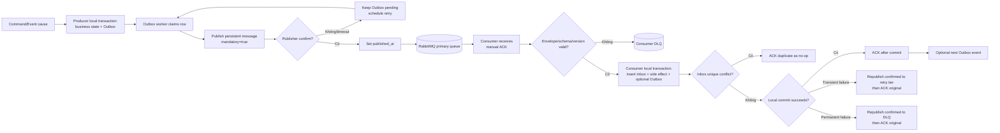

# Message Lifecycle — Outbox, Inbox và ACK

Sơ đồ áp dụng cho mọi event/async command quan trọng.

## Crash windows

| Crash point | Kết quả đúng |
|---|---|
| Sau business commit, trước publish | Outbox row còn pending và được worker khác publish. |
| Sau broker nhận, trước producer nhận confirm | Producer có thể publish lại; Inbox dedupe ở consumer. |
| Sau consumer commit, trước ACK | RabbitMQ redeliver; Inbox biến lần giao lại thành no-op. |
| Khi republish retry chưa confirm | Không ACK bản gốc, tránh mất message. |

