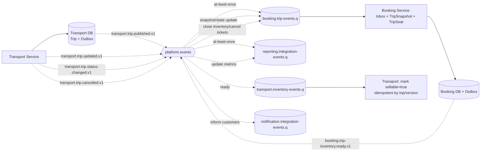

# Event Flow — Vòng đời Trip

Nguồn: `UC-OPS-05`, `UC-OPS-06`, `UC-TRIP-01`, `BP-04..06`.

## Consistency rules

- Trip được persist `SCHEDULED, sellable=false` trước khi `TripPublished` được phát.
- Chỉ `TripInventoryReady` đúng trip/source version mới cho Transport mark `sellable=true`.
- `TripUpdated` chỉ thay snapshot field được phép; dữ liệu Booking/Ticket lịch sử không bị rewrite.
- `TripCancelled` đóng inventory trước, sau đó Booking xử lý affected booking theo batch/checkpoint.
