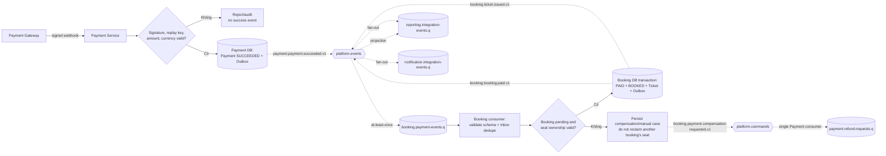

# Event Flow — Payment xác nhận Booking và Ticket

Nguồn: `UC-PAY-01`, `BP-01`, `QA-02`, `QA-03`.

## Correctness rules

- Payment webhook trả 2xx sau khi Payment state + Outbox đã commit, không chờ Booking/Notification/Reporting.
- Duplicate webhook không tạo `PaymentSucceeded` lần hai; duplicate delivery không tạo Ticket lần hai.
- Booking kiểm tra amount/currency/reference và state guard, không chỉ tin event name.
- Nếu payment thành công trễ nhưng không thể cấp ghế, đi vào compensation/refund hoặc manual case.
