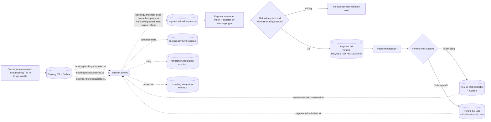

# Event Flow — Hủy và Refund

Áp dụng cho Customer hủy Ticket, đổi vé cần hoàn chênh lệch và Operator/Admin hủy Trip.

## Correctness rules

- Quyền dùng Ticket bị thu hồi trước/độc lập với kết quả Refund; Refund lỗi không phục hồi Ticket.
- `BookingCancelled` chỉ đóng/cancel payment intent chưa có final success; nó không tự tạo Refund.
- `RefundRequested` mang logical refund reference và Payment ID; retry không tạo Refund mới.
- Consumer khóa/kiểm tra Payment để tổng refund thành công không vượt số tiền đã thu.
- `RefundFailed` là design event phục vụ hội tụ UI/support; không có nghĩa tự động charge/refund lại.
