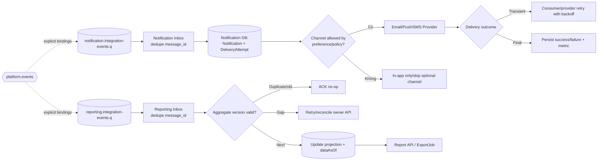

# Event Flow — Notification và Reporting

Trong MVP, nhánh Notification dùng allow-list policy cố định cho `IN_APP`/`EMAIL`; preference và ExportJob trong sơ đồ là nhánh P1, không có binding/worker/runtime cho tới khi được đưa vào release.

Hai service này là consumer ngoài critical path. Mỗi service có queue, Inbox và failure policy riêng.

## Isolation rules

- Lỗi Notification/Reporting không rollback Booking, Payment, Ticket hoặc Trip.
- Mỗi queue retry/DLQ độc lập; poison message của Reporting không chặn Notification.
- Notification payload tối thiểu và không chứa secret/PII không cần thiết.
- Reporting không bind wildcard `#`, không join trực tiếp transaction DB và luôn công bố `dataAsOf`.
