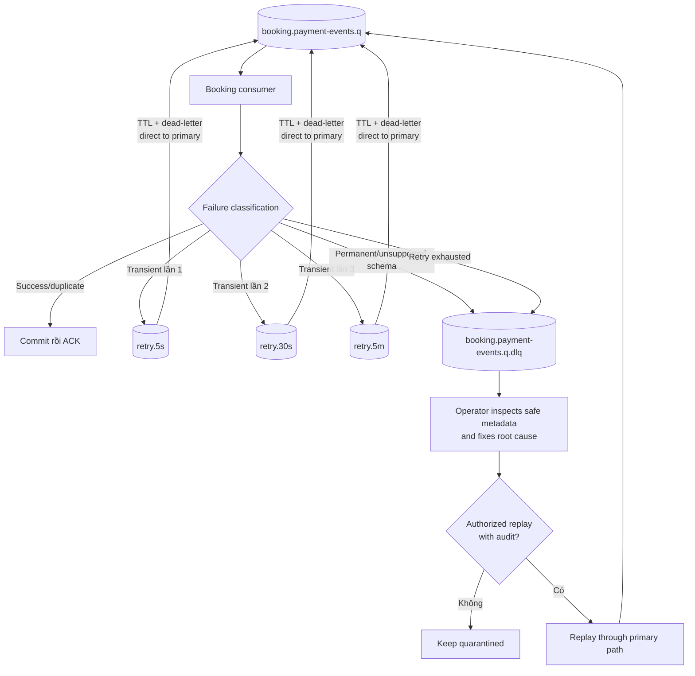

# RabbitMQ Retry và Dead-letter Flow

Ví dụ dùng primary queue `booking.payment-events.q`; mọi consumer queue áp dụng cùng pattern với policy riêng.

## Retry rules

- Không dùng immediate `requeue=true` vô hạn.
- Republish đến retry/DLQ phải nhận publisher confirm rồi mới ACK message gốc.
- Retry queue quay trực tiếp về đúng primary queue, không fan-out lại sang consumer khác.
- DLQ giữ message ID/type/version, queue nguồn, safe error code, first/last failure, retry count và correlation ID.
- Không sửa payload trong DLQ rồi replay; correction tạo message mới và audit liên kết message cũ.

