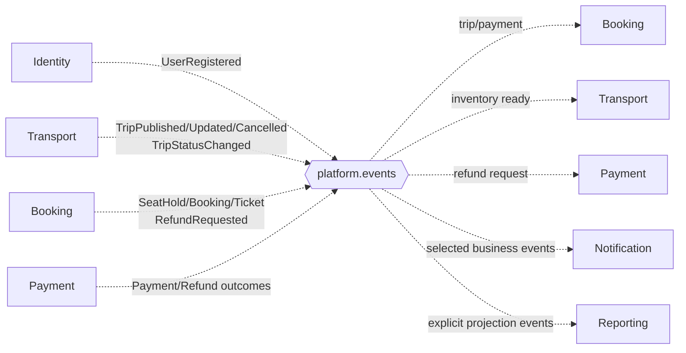

# Event và Routing Catalog

Routing key theo mẫu `<bounded-context>.<aggregate-or-capability>.<action>.v<major>`. Exchange không chứa version; version nằm trong routing key và envelope.

## SRS baseline events

| Event type | Routing key v1 | Producer | Consumer chính |
|---|---|---|---|
| `UserRegistered` | `identity.user.registered.v1` | Identity | Notification, Reporting |
| `TripPublished` | `transport.trip.published.v1` | Transport | Booking, Reporting |
| `TripUpdated` | `transport.trip.updated.v1` | Transport | Booking, Notification, Reporting |
| `TripCancelled` | `transport.trip.cancelled.v1` | Transport | Booking, Notification, Reporting |
| `SeatHoldCreated` | `booking.seat-hold.created.v1` | Booking | Reporting |
| `SeatHoldExpired` | `booking.seat-hold.expired.v1` | Booking | Reporting |
| `BookingCreated` | `booking.booking.created.v1` | Booking | Payment, Reporting |
| `PaymentSucceeded` | `payment.payment.succeeded.v1` | Payment | Booking, Reporting |
| `PaymentFailed` | `payment.payment.failed.v1` | Payment | Booking, Notification, Reporting |
| `BookingPaid` | `booking.booking.paid.v1` | Booking | Notification, Reporting |
| `TicketIssued` | `booking.ticket.issued.v1` | Booking | Notification, Reporting |
| `BookingCancelled` | `booking.booking.cancelled.v1` | Booking | Payment, Notification, Reporting |
| `RefundRequested` | `booking.refund.requested.v1` | Booking, kể cả business flow do Admin khởi tạo | Payment |
| `RefundSucceeded` | `payment.refund.succeeded.v1` | Payment | Booking, Notification, Reporting |
| `PassengerCheckedIn` | `booking.ticket.checked-in.v1` | Booking | Reporting |

## Design events cần cho workflow đầy đủ

| Message type | Routing key v1 | Exchange | Mục đích |
|---|---|---|---|
| `TripInventoryReady` | `booking.trip-inventory.ready.v1` | `platform.events` | Chỉ mở `sellable=true` sau khi TripSeat đã sẵn sàng. |
| `TripStatusChanged` | `transport.trip.status-changed.v1` | `platform.events` | Đồng bộ lifecycle Trip sang Booking/Reporting. |
| `TicketCancelled` | `booking.ticket.cancelled.v1` | `platform.events` | Notification/Reporting theo dõi hủy từng Ticket. |
| `TicketChanged` | `booking.ticket.changed.v1` | `platform.events` | Gửi vé thay thế và cập nhật projection. |
| `RefundFailed` | `payment.refund.failed.v1` | `platform.events` | Hiển thị trạng thái cần retry/manual review. |
| `PaymentCompensationRequested` | `booking.payment.compensation-requested.v1` | `platform.commands` | Yêu cầu Payment hoàn khoản thành công trễ khi không thể cấp ghế. |

Các design event phải có JSON Schema/AsyncAPI contract, owner và compatibility test trước khi triển khai; chúng không tạo thêm hành vi người dùng ngoài SRS mà hoàn thiện handoff kỹ thuật giữa các service.
