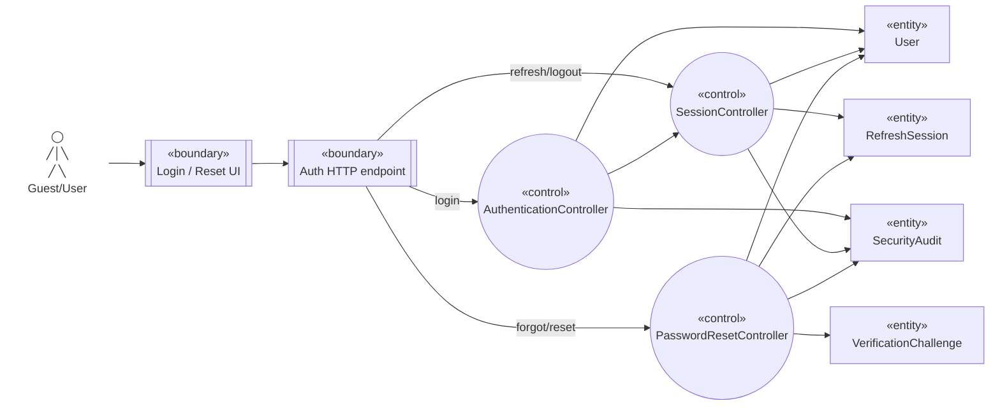

# Robustness — Authentication

Nguồn: `UC-AUTH-02`, `UC-AUTH-03`, `UC-AUTH-04`.

## Trách nhiệm kiểm tra

- Boundary chỉ parse/validate shape, rate-limit context và chuyển correlation ID.
- Control xác thực credential/challenge, generic error, rotation/revoke và transaction boundary.
- User/Session/Challenge bảo toàn status, hash, expiry và replay invariant; Audit append-only.

