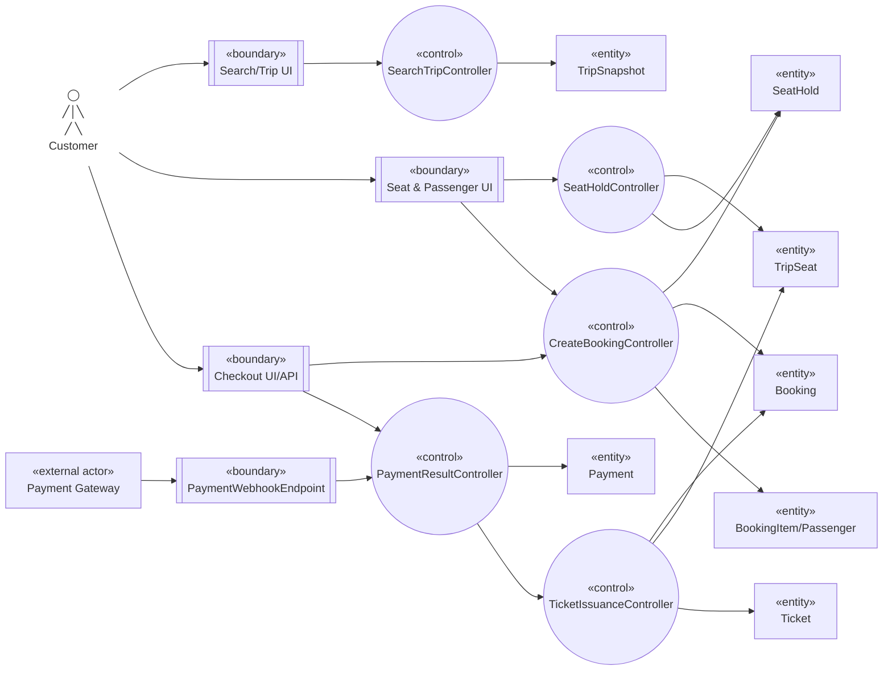

# Robustness — Đặt vé và thanh toán

Nguồn: `UC-SEARCH-01`, `UC-BOOK-01`, `UC-PAY-01`, `UC-TICKET-01`.

## Trách nhiệm kiểm tra

- `SeatHoldController` lock mọi TripSeat theo thứ tự ổn định và commit all-or-nothing.
- `CreateBookingController` tin giá server/snapshot, không tin total từ client.
- `PaymentResultController` chỉ nhận kết quả đã xác minh/deduplicate; redirect UI không gọi phát hành vé.
- `TicketIssuanceController` idempotent theo Booking Item và xác nhận seat ownership trước khi `BOOKED`.

