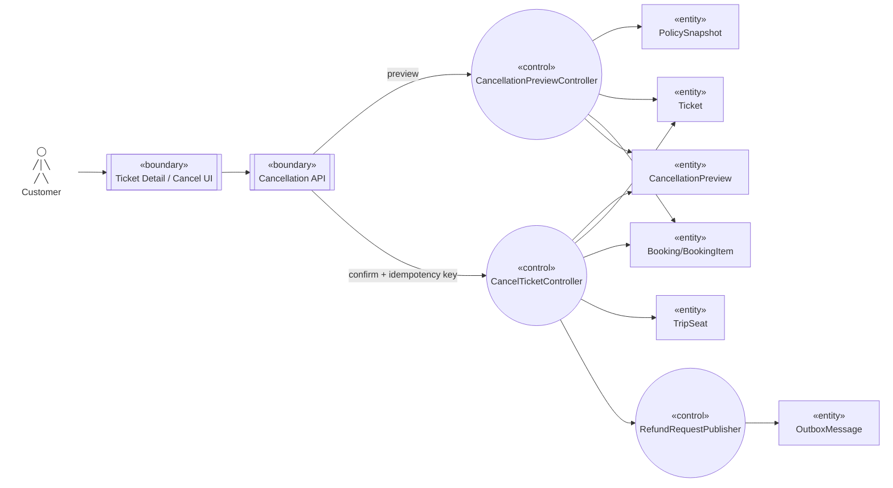

# Robustness — Hủy vé và hoàn tiền

Nguồn: `UC-CANCEL-01`, `BP-02`.

## Trách nhiệm kiểm tra

- Preview kiểm tra ownership/state/time/policy nhưng không thay đổi Ticket.
- Confirm kiểm tra lại preview version và điều kiện trong transaction; preview cũ buộc tính lại.
- Seat chỉ được release khi vẫn thuộc Ticket/Booking đó và Trip còn bán.
- Refund publisher ghi Outbox cùng transaction hủy; lỗi Payment không phục hồi Ticket.

