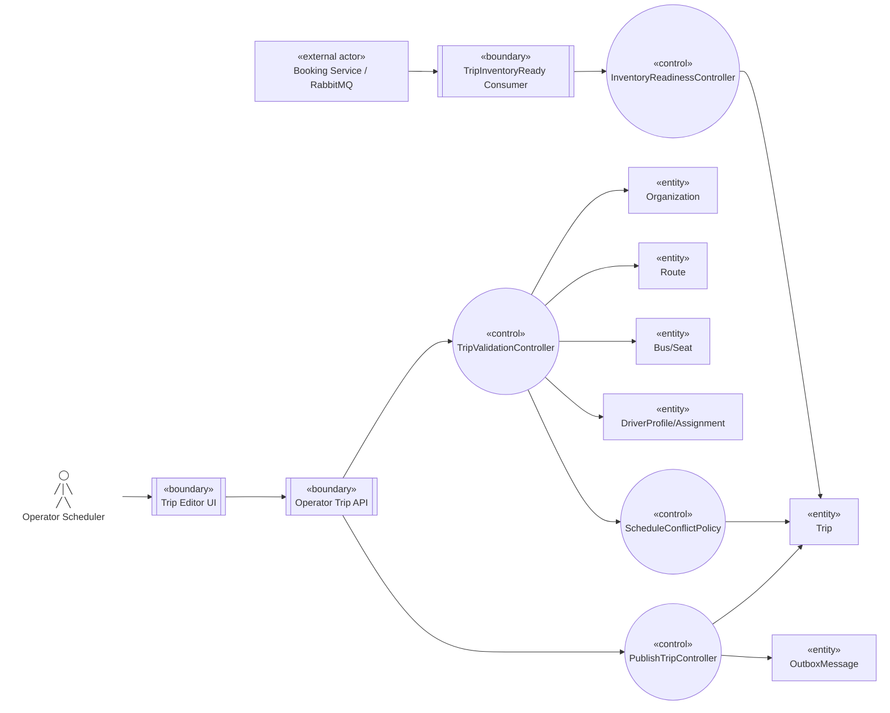

# Robustness — Tạo và mở bán Trip

Nguồn: `UC-OPS-05`, `BP-04`.

## Trách nhiệm kiểm tra

- Validation kiểm tra tenant/resource/license/time; conflict policy kiểm tra interval và buffer Bus/Driver.
- Publish ghi `SCHEDULED`, `sellable=false`, immutable snapshot và `TripPublished` Outbox.
- Inventory readiness chỉ mark sellable khi nhận `TripInventoryReady` đúng trip/source version.
- Command publish lặp không tạo snapshot hoặc inventory lần hai.
