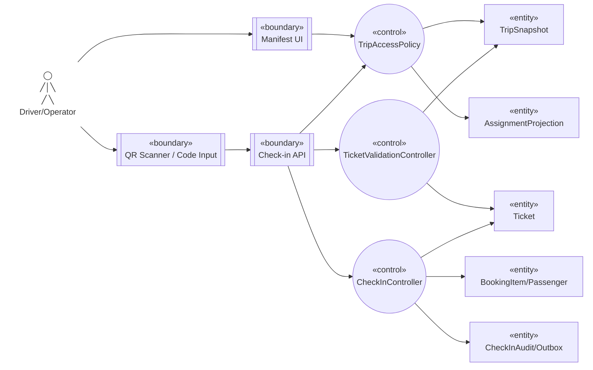

# Robustness — Check-in hành khách

Nguồn: `UC-OPS-06`, `UC-DRIVER-01`, `BP-05`.

## Trách nhiệm kiểm tra

- Access policy lọc manifest theo assignment/tenant trước khi trả PII tối thiểu.
- Validation xác minh QR/hash, đúng Trip và Ticket `ISSUED`; client scan không quyết định hợp lệ.
- Check-in dùng state/version guard; request lặp trả `checkedInAt` cũ.
- Outcome ghi audit/correlation và `PassengerCheckedIn` Outbox trong cùng transaction.

