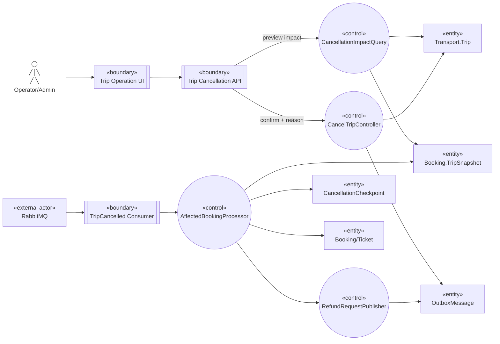

# Robustness — Hủy Trip

Nguồn: `UC-TRIP-01`, `BP-06`.

## Trách nhiệm kiểm tra

- Transport control kiểm tra permission/tenant/state/version; hủy thông thường chỉ từ `SCHEDULED/BOARDING`.
- `TripCancelled` kích hoạt Booking processor; batch checkpoint cho phép resume mà không hủy/refund lặp.
- Booking thu hồi Ticket trước khi request Refund; nhà xe hủy không áp phí hủy Customer.
- Notification/Reporting không nằm trong transaction hủy.
