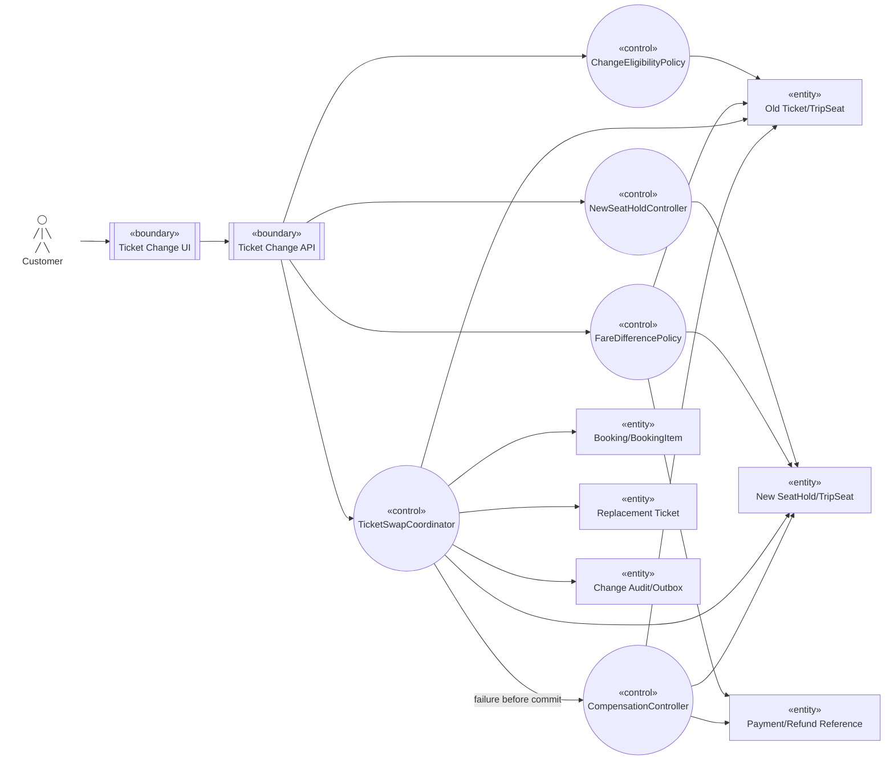

# Robustness — Đổi vé

Nguồn: `UC-CHANGE-01`, `BP-03` (`SHOULD`).

## Trách nhiệm kiểm tra

- Eligibility và hold mới hoàn tất trước khi tác động Ticket cũ.
- Fare policy tính phí/chênh lệch phía server; payment bổ sung phải thành công trước commit swap.
- Swap coordinator bảo đảm tại điểm commit chỉ Ticket mới có hiệu lực; command lặp trả cùng logical change.
- Compensation hoàn khoản thu thêm/release hold mới và giữ Ticket cũ nếu chưa qua điểm commit.
